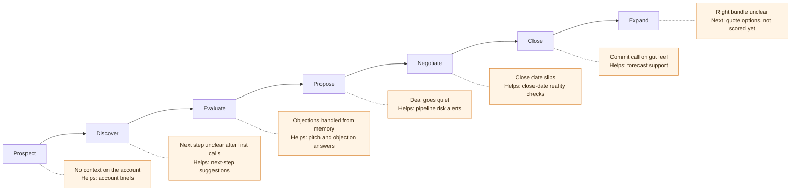

# CRM Data Readiness Scan

GTM Trust Kernel · npm: `gtm-trust-kernel`

**Faster, cleaner deals start with CRM data your sellers can trust.**

Revenue outcome ← seller decision ← AI assist ← CRM data ← this scan.

AI can help sellers make better calls on their deals. It is not the
point; the seller's decision is. This scan checks the CRM data underneath,
before AI goes on top. It checks your data, not the AI tools.

For each AI use case, such as account briefs or forecast support, it says
whether your data is ready, with the numbers behind every verdict. It only
reads your CRM. It never writes to it.

There is also a trust layer for teams that go further: AI can suggest
changes; nothing is written without approval, and every change is logged.

[](https://github.com/pretzelslab/gtm-trust-kernel/actions/workflows/ci.yml)
[](https://www.npmjs.com/package/gtm-trust-kernel)
[](https://www.npmjs.com/package/@gtm-trust-kernel/adapters)
[](LICENSE)

**Status:** early open-source release. The npm CLI runs on built-in sample
data. Scanning a live Salesforce org runs from a clone of this repo.

## Where AI helps sellers, and what it needs

Read each row from left to right: the outcome you care about, the moment in
a deal where it is won or lost, the decision a seller makes there, the AI
that can help, and the data that AI depends on.

| Revenue outcome | Deal friction / seller moment | Decision it supports | AI assist (use case) | What the scan checks |
|---|---|---|---|---|
| **Deal velocity** | Deals stall between stages; reps spend time on the wrong deals | Which deals need attention this week, and what to do next | Pipeline risk alerts; next-step suggestions on deals | Activities captured, stages mapped, stage history, deals touched recently, next steps filled in |
| **Win rate** | Reps walk into calls without context and handle objections from memory | How to prepare for this account and answer this objection | AI-generated account briefs; pitch and objection-handling answers | Notes with real content, few duplicate accounts, enough closed deals, evidence kept on closed deals |
| **Forecast accuracy** | Close dates slip; commit calls rest on gut feel | Which deals to call commit, and which close dates to challenge | Forecast support; close-date reality checks | Amounts and close dates filled in, stages mapped, close-date history, past-due close dates, enough closed deals |
| **Rep ramp / enablement** | New reps don't know how similar deals were won or lost | What worked on deals like this one | Pitch and objection-handling answers; AI-generated account briefs | Enough closed deals, evidence kept on closed deals, notes with real content |
| **Attach and expansion** | The right products and bundle for this account aren't clear | Which options to put in front of the buyer | Quote options (next, not scored yet) | Not measured yet |

Two use cases sit under every row. Bulk data clean-up suggestions keep the
data usable, with a person approving each batch. Fully automatic CRM
updates stay not ready, by design.



The scan checks data readiness. It doesn't cause or measure revenue
outcomes.

### Measure the outcome

If you roll AI out, track deal velocity, win rate and forecast error before
and after, on the deals where sellers use it. The scan doesn't measure
these. It tells you whether the data is ready for AI to support the
decisions behind them.

## Why this matters

Each of those moments depends on the same CRM data. Check your data before
you buy. The usual problems:

- **No single record of the truth.** The same deal or account exists in
  more than one place, and nobody agrees which copy is right.
- **Data that doesn't match across systems.** The CRM says one thing,
  billing or the support desk says another.
- **Poor hygiene.** Missing close dates and amounts, stages nobody mapped,
  duplicate accounts, notes that say "follow up".
- **Stale updates.** Deals that haven't been touched in weeks, close dates
  already in the past, next steps nobody revisited.
- **Systems that can't be joined.** If a contact or account in one system
  can't be matched to the same one in another, no AI tool can combine them
  into a true picture. The scan's cross-system matching checks measure
  this directly (see [Known limits](#known-limits) for where they run today).

The scan measures hygiene, freshness and joinability directly. The first
two problems show up indirectly, through duplicate accounts and
cross-system matching rates.

An AI tool fed this data still gives answers. They just aren't right, and
the reps who notice stop using it.

## Who it's for, and what it isn't

**For:**

- RevOps, sales ops and GTM ops leads asked "is our CRM ready for AI?"
- Revenue enablement managers planning AI help for reps.
- Engineers who want a readiness check in CI (`--fail-on`).

**It is not:**

- **An AI tool evaluator.** It doesn't compare or score AI vendors or
  models.
- **A data cleaner.** It reads and reports. It doesn't fix records. It
  tells you which checks are holding each use case back.
- **A way for your data to leave your machine.** Record text stays on your
  machine. The only thing that can be sent anywhere is the optional AI
  summary, which sends metric names and values, never record text, and
  only after you say yes. See [Privacy](#privacy-and-where-data-goes).

## Check the data before you put AI into these moments

Each AI use case needs certain things from your data. The scan checks those
things and gives each use case one verdict.

| Verdict | What it means |
|---|---|
| **Ready to use** | Every check this use case depends on passes |
| **Usable with caution** | It can run, on thinner evidence than ideal. The report names the weak checks |
| **Not ready yet** | Data it needs is missing or poor |
| **Can't tell yet** | The scan can't see the data it would need (for example, activity capture isn't declared), so it says nothing either way |

| Use case | What it needs from your data | Also reported (informs, doesn't decide the verdict) |
|---|---|---|
| **AI-generated account briefs** | Notes on most open deals, notes with real content, notes long enough to use, few duplicate accounts | Account and contact matching across systems |
| **Forecast support** | Stages mapped, win rates that differ by stage, enough closed deals in the last 12 months, amounts filled in, few past-due close dates | Round-number amounts, deal owner filled in |
| **Pipeline risk alerts** | Activities captured, stages mapped, months of stage history, deals touched recently | Stages that contradict activity, age of next steps, owner history |
| **Close-date reality checks** | Close dates filled in, close-date history on, few past-due close dates | |
| **Next-step suggestions on deals** | Activities captured, next steps filled in, notes with real content, contacts linked to deals | Age of next steps, activities matched to deals across systems |
| **Pitch and objection-handling answers** | Enough closed deals in the last 12 months, evidence kept on closed deals, notes with real content | |
| **Bulk data clean-up suggestions** (a person approves each batch) | Stages mapped, few duplicate accounts, close dates filled in | |
| **Fully automatic CRM updates with no human check** | Stages mapped, few duplicates, activities captured, enough closed deals, few date anomalies, a low share of text written by people outside your company | |

The "Also reported" metrics sit next to the use case they inform most.
They are shown in the report but never change a verdict.

Every run also reports **PII density**: how much personal data (phone
numbers, card-like numbers, ID-like numbers) sits in notes and activities.
It applies to every use case, because it tells you how much redaction is
needed before any text goes to an AI tool. It doesn't change a verdict.

**Fully automatic CRM updates is not ready, by design.** The plain report
never shows it as "Usable with caution": anything short of a full pass
reads **Not ready yet**, because AI writing to your CRM needs a person to
check every change.

The thresholds behind each check are provisional. They haven't been
calibrated on real orgs yet ([help us do that](#help-calibrate-the-thresholds)).
`latest.html` shows every metric, its threshold and its sample size.

**Next, not scored yet:** AI-suggested quote options.

## Try it in 2 minutes

Requires [Node.js](https://nodejs.org) 22 or newer.

```bash
npx gtm-trust-kernel scan --demo
```

```text
Demo scan of sample CRM data ("Healthy"): 4 ready, 3 use with caution, 1 not ready.
Open out/latest-plain.html for the plain-English report (full detail: out/latest.html).
```

This runs on a built-in sample CRM. No login, no account, no network calls.
The reports are written to `./out` in the folder you ran it from. Open
`out/latest-plain.html` first. An excerpt:

```text
Ready to use
  Pipeline risk alerts: stalled, silent or slipping deals can be flagged automatically.
  Close-date reality checks: deals with unrealistic or already-passed close dates can be flagged.
Usable with caution
  AI-generated account briefs: account summaries can be generated, but with thinner supporting
  evidence than ideal. Right now, notes and activity text aren't detailed enough.
Not ready yet
  Fully automatic CRM updates with no human check: AI should not write to the CRM without
  a person checking every change yet.
```

`out/latest.html` has the full detail: every metric, its threshold, the
sample sizes and the seed.

### Scan your own Salesforce org

Live scanning isn't in the npm CLI yet. It runs from a clone of this repo,
and it is read-only.

1. Clone the repo and run `npm install`.
2. Set up a Salesforce connected app and a `.env` file:
   [Salesforce setup](packages/readiness/docs/salesforce-setup.md).
3. From `packages/readiness`, run `npm run report -- --live`.

Before it reads any records, the scan checks that it can sign in and read
every object and field it needs, and that the run fits in your org's
remaining daily API calls. It keeps 10% of your daily limit free for your
other tools. If something is wrong, it stops and tells you what, one line
per problem.

### Useful options

| Option | What it does |
|---|---|
| `--narrative` | Add an AI-written summary. Needs `ANTHROPIC_API_KEY`. Asks before sending anything |
| `--narrative-preview` | Show the exact request `--narrative` would send. Sends nothing |
| `--fail-on` | For CI: exit with code 2 if any use case has a verdict you list (a bare `--fail-on` means blocked). How the plain verdict words map to these: [CLI README](packages/cli/README.md#verdict-words) |
| `--show-org` | Live scans only: include your org's hostname in the reports (it's left out by default) |

All options, exit codes and `--fail-on` details:
[CLI README](packages/cli/README.md).

## Privacy and where data goes

- **Your CRM records stay on your machine.** They are held in memory for
  the length of the run. Reports hold only counts, rates and verdicts:
  no note text, names, emails or record ids.
- **The scan cannot write to your CRM.** The Salesforce connection is
  read-only.
- **The AI summary is opt-in.** `--narrative` sends metric names, values
  and ratings to Anthropic's API, which is hosted in the US. It never
  sends record text, names, emails, record ids or your org's hostname. It
  asks first; answering no writes the report without it. For runs with no
  one at the keyboard, `--narrative-consent` gives consent up front. If
  your company needs to review data sent outside your country,
  `--narrative-preview` shows the exact request and sends nothing.
- **Your org's hostname is left out of live reports by default**, because
  reports get shared. `--show-org` adds it, and the report says so. Every
  report's banner states what left the machine on that run.
- **The Salesforce sign-in token is cached** in your user settings folder,
  readable only by you on macOS and Linux. On Windows it relies on your
  user profile folder being private, which is the default. Delete the file,
  or revoke the token in Salesforce, to end it.

The full list of what is read, stored and sent, and for how long:
[docs/DATA-FLOW.md](docs/DATA-FLOW.md). Tests check on every CI run that no
record text, names or emails reach a report or the AI summary request.

## Common objections

**"We already have a data quality tool."**
Keep it. A data quality tool tells you which records break your rules.
This scan answers a different question: which AI use cases your data can
support today, and which checks hold each one back.

**"Is our data safe?"**
The scan only reads, keeps record text in memory, and writes reports that
hold counts and verdicts only. Nothing leaves your machine unless you turn
on the AI summary and say yes. See [Privacy](#privacy-and-where-data-goes).

**"Why not buy the AI tool now and clean the data later?"**
You can. But the tool's first answers are the ones reps judge it by. A
scan takes minutes, costs nothing, and tells you which use case your data
can support first.

**"How long does a scan take, and what does it cost in API calls?"**
The demo takes seconds and makes no calls. On a live org, the scan prints
its planned API calls before it reads anything, and won't start a run that
doesn't fit your remaining daily limit.

On a small Salesforce Developer Edition org (35 deals, all scanned), a full
live scan took about 11 seconds. The checks before the scan passed, with
one expected warning. Before reading, it printed:

```text
Quota: 260 calls planned (up to 255 + at least 5); your org has 14897 of its 15000 daily calls left and this tool keeps 1500 in reserve, so 13397 are free for this run
```

The plan is a worst-case ceiling. Measured on the same org, the checks
before the scan used 11 calls and the reads used 12. Large orgs haven't
been measured yet. The scan has no fee; the optional AI summary is one
request on your own Anthropic key.

**"Does it work with HubSpot?"**
Not yet. Salesforce is the only CRM it can scan today. HubSpot is planned.

## Known limits

- **Thresholds are provisional.** They haven't been calibrated on real
  orgs yet.
- **Salesforce only, and live scans run from a repo clone,** not the npm
  CLI. It has been tested on a Salesforce Developer Edition org, not on
  large production orgs.
- **Cross-system matching runs on the demo data only.** A live scan
  doesn't connect a second system yet, so those checks read Not ready yet
  on a live org. They don't decide any use case's verdict.
- **Activity capture is something you declare, not something the scan
  detects.** Until you set `SF_ACTIVITY_CAPTURE=auto`, activity checks
  read "Can't tell yet". Activities logged only against a contact, not the
  deal, aren't counted yet.
- **Smaller gaps:** very long Enhanced Notes past the fetch limit show
  their length as a minimum; deal currency isn't read; a dropped network
  connection isn't retried (rate limits and Salesforce outages are).

## Help calibrate the thresholds

The verdicts are only as good as the thresholds behind them, and those need
real orgs. If you run the scan, you can help by sharing your anonymised
scores: **share anonymised scores, never data.** The form only offers
fixed choices (verdicts and value ranges), so it has no place for record
data. [Share your scores](https://github.com/pretzelslab/gtm-trust-kernel/issues/new?template=calibration-scores.yml).

## For engineers

| Package | Path | Published |
|---|---|---|
| `gtm-trust-kernel` (CLI) | `packages/cli` | Yes |
| `@gtm-trust-kernel/adapters` | `packages/adapters` | Yes |
| kernel (proposals, audit ledger) | `packages/kernel` | No |
| readiness (metrics, report) | `packages/readiness` | No, bundled into the CLI |

- **Adapters.** A CRM-neutral data model and a read-only Salesforce
  adapter, with a preflight check, retry on rate limits and tracking of
  the org's daily API calls. The mock and Salesforce adapters pass one
  shared contract suite; the Salesforce adapter passes it against a live
  Developer Edition org, re-run weekly in CI.
- **Trust kernel.** CRM notes are untrusted text: customers and partners
  write them, and an AI reading them can be steered by them. The kernel
  lets an AI propose a field change only with cited evidence, applies it
  only after a person approves, and records every step in a hash-chained
  audit log with rollback. Its seven invariants, each covered by tests,
  are in [docs/ARCHITECTURE.md](docs/ARCHITECTURE.md#the-seven-invariants),
  with its known gaps.
- **Metrics.** Every metric is a pure function, and no model call
  influences a number. Definitions:
  [metric-definitions.md](packages/readiness/docs/metric-definitions.md).

```bash
npm install
npm run ci
```

Current status and what's next: [STATUS.md](packages/readiness/docs/STATUS.md).
See also [CONTRIBUTING.md](CONTRIBUTING.md), [SECURITY.md](SECURITY.md) and
[RELEASING.md](RELEASING.md).

## License

MIT.
