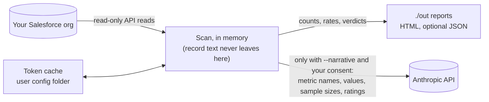

# Data flow

What the tool reads, what it stores, what leaves your machine, and for how
long. Current as of 2026-10-03 (CLI 0.2.0 and adapters 0.3.0, not yet
published). This page describes the tool's behaviour. It is not legal
advice.

`npx gtm-trust-kernel scan --demo` runs on bundled sample data: it reads no
CRM and, without `--narrative`, makes no network calls. Live scans
(`npm run report -- --live`, from a repo clone) are the only path that
reads a real org.

## What is read

| Source | What | Where it goes |
|---|---|---|
| Salesforce API (your org) | Deals (opportunities), contact roles, accounts, contacts, Tasks, Events, Notes, Enhanced Notes, stage history. This includes free text such as deal names, next steps, note bodies and activity subjects, and contact names and emails | Memory only, for the length of the run. Reports carry only computed counts, rates, booleans and verdicts |
| Your environment or a `.env` file you create (the first found: the folder you run the report from, then the repo root; your shell's variables win) | `SF_CLIENT_ID`, `SF_CLIENT_SECRET`, `SF_INSTANCE_URL`, `ANTHROPIC_API_KEY` and optional settings | Used to authenticate. Never logged, never written to a report. The run prints which folder's `.env` it used, not the path |

Emails used for cross-system matching are trimmed, lowercased and hashed
with a salt generated once per run; the salt and hashes stay in memory
([metric-definitions.md](../packages/readiness/docs/metric-definitions.md),
D5).

What goes **to** Salesforce: the client id and secret (to its token
endpoint), the access token, and SOQL queries that contain record ids.
Before a live scan, a preflight also asks for the org's API versions, its
object list, the field list of each object the report reads, and, only
if no response has reported the org's daily API usage, `/limits`. These
return metadata, not records. The adapter has no write path.

What comes back besides records: the org's daily API usage, from the
`Sforce-Limit-Info` header on each response. It stays in memory and
appears only in terminal output (the sampling plan and quota messages),
never in a report.

## What is stored on disk

| File | Contents | Location | Protection | Kept until |
|---|---|---|---|---|
| Token cache | A Salesforce access token and the instance URL | Your user config folder: `%LOCALAPPDATA%\gtm-trust-kernel\` (Windows), `~/Library/Application Support/gtm-trust-kernel/` (macOS), `$XDG_CONFIG_HOME/gtm-trust-kernel/` or `~/.config/gtm-trust-kernel/` (Linux). One `salesforce-token-<hash>.json` per org and connected app. `SF_TOKEN_CACHE_PATH` overrides it | macOS/Linux: file 0600, folder 0700 when the tool creates it. Windows: see below | Overwritten when the token is refreshed. Delete the file, or revoke the token in Salesforce, to end it |
| HTML reports | Metric values, thresholds, verdicts, sample sizes, the seed, timestamps. A live report leaves out the org hostname unless you pass `--show-org` (the report then says so) | `./out/` in the folder you run from (`latest*.html` plus a timestamped copy per run) | Ordinary files | Never pruned. Delete them when you no longer need them |
| JSON report (`--json`) | The same data as the HTML reports | `./out/` (`npm run report`) or stdout (the CLI) | Ordinary files | As above |

No record text, contact name, email or record id is written to any report;
the canary tests below check this on every CI run.

**Windows assumption.** Windows has no Unix mode bits, so the token file
relies on `%LOCALAPPDATA%` being private to your account by default (you,
SYSTEM and Administrators). If your profile folder's permissions have been
widened, the token file is exposed the same way.

**Older versions.** Adapters 0.2.0 and earlier cached the token inside the
adapters package folder. The first live run with 0.2.1 deletes that file
(it is not moved), so it fetches one new token.

## What leaves your machine

| Destination | When | What | What is never sent |
|---|---|---|---|
| Your Salesforce org | Live scans only | Authentication and read queries (above) | Nothing is written |
| Anthropic's API (hosted in the US) | Only with `--narrative`, and only after consent: a "y" at the prompt, or `--narrative-consent` for runs with no terminal. Answering no runs the report without the AI summary | One request per run: metric names, values, tiers, thresholds, sample sizes, the code-generated note for each metric, capability verdicts, and the report timestamps | Record text, names, emails, record ids, the org hostname |

`--narrative-preview` prints that exact request on stdout and sends
nothing, so you can review it first. The request is built in one place,
[`narrativeRequest.ts`](../packages/readiness/src/report/narrativeRequest.ts),
and the client sends exactly what it returns.

When you turn on `--narrative`, Anthropic processes that request under its
own API terms and data-retention policy; see Anthropic's
[Privacy Center](https://privacy.anthropic.com) and
[commercial terms](https://www.anthropic.com/legal/commercial-terms) for the
current details. This page doesn't restate them, because they can change.

Both report banners state what left the machine on that run: "nothing
leaves this machine" (sample data) or "nothing else left this machine"
(live), or that metric values were sent to Anthropic for the AI summary.

## Retention summary

| Data | Retained |
|---|---|
| CRM records and their text | Only in memory, for the length of the run |
| Hashed emails and their salt | Only in memory, for the length of the run |
| Token cache | On disk until overwritten or deleted. The token itself expires under your org's session policy |
| Reports in `./out` | On disk until you delete them |
| Narrative request | Not stored locally. At Anthropic, per their policy |

## How this is enforced

- `redactionCanary.test.ts` seeds fake PII and injection strings into every
  text field of a sample org, then checks that none appear in the JSON, any
  HTML report, console output, or the narrative request, which also must
  not carry the org hostname or any record id.
- `salesforceCanary.test.ts` does the same through the Salesforce adapter
  (on a fake API), including Enhanced Note and Event text.
- `orgRedaction.test.ts`: a live-shaped report has no hostname in the JSON
  or either HTML report unless `--show-org` is passed.
- `narrativeRequest.test.ts`: the client sends exactly the previewed
  request. The consent tests check that nothing is sent without consent.
- `salesforce.tokenCache.test.ts`: token file 0600 and folder 0700 (run on
  Linux in CI), and deletion of the old cache file.

## Known gaps

- Error messages printed to the terminal can include the body of a
  Salesforce error response, which may echo query fragments or record ids.
  They are not written to the reports. Preflight and rate-limit messages
  are the exception: they carry Salesforce error codes only.
- The proposal kernel's audit ledger (actor ids, field names, record ids)
  exists only in memory and isn't reachable from any command yet.
